# Kill Clog

PvM-Focused HiScores Overhaul with Collection Log Integration

When you click Install, RuneLite prompts a warning about your IP being sent to a 3rd-party server.

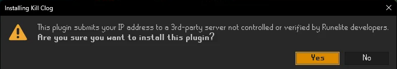

The 3rd-party is [TempleOSRS](https://templeosrs.com). Kill Clog reads your public collection log data from there.

Kill Clog never collects passwords, tokens, bank data, account credentials, or private RuneLite data. Source is fully public at [github.com/420kc/kill-clog-plugin](https://github.com/420kc/kill-clog-plugin) and open to audit.

sync with a single click

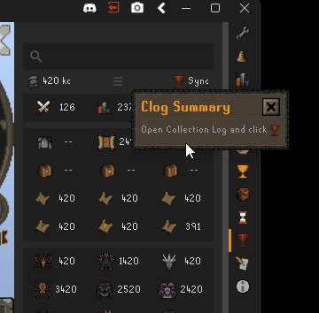

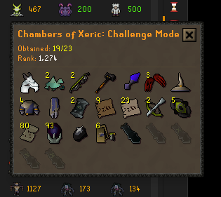

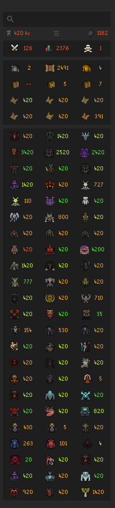

## Tooltips

| | |
|:---:|:---:|
| 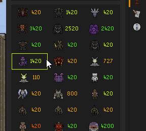 | 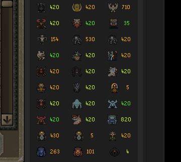 |
| Hover \| Outline | Click \| Tint |

## Quick Lookup

Right-click "Kill Clog" on any player name to look them up instantly. Works on friends list, ignore list, friends chat, clan + guest clan, GIM panel, chatbox, and private messages. Side panel auto-opens.

Double-click the magnifying-glass icon in the search bar to look up yourself.

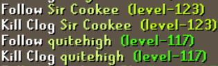

## Chat Commands

`!kclog [boss]` in any chat tab replaces your line with your collection log progress for that boss, plus the inline sprites of every unique you've already obtained. Common shorthand works (`!kclog vork`, `!kclog cox`, `!kclog tob`, `!kclog jad`); partial typing falls through to substring match.

`Vorkath: 12/14 [item] [item] [item] ...`

Lookups share the panel's cache, so the command stays fast.

## Player Comparison

Go head-to-head with player comparisons

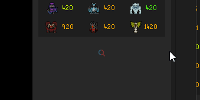

| | |
|:---:|:---:|
| 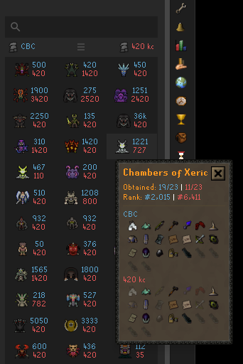 | 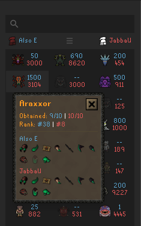 |

## Summaries

| | | |
|:---:|:---:|:---:|
| 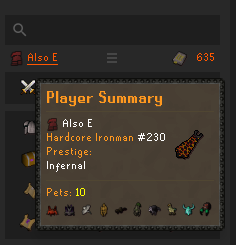 | 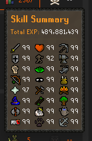 | 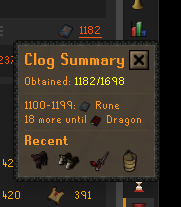 |
| 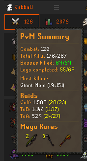 | 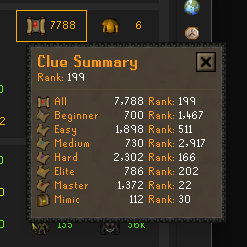 | 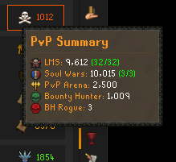 |

## Activities Tray

| | | |
|:---:|:---:|:---:|
| 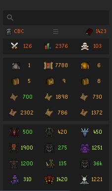 | 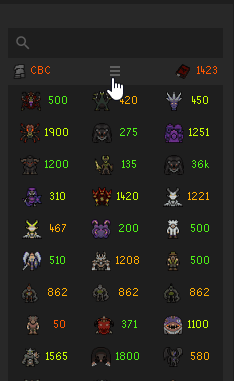 | 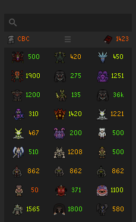 |

Data | Focus

## Progress Highlighter

| | |
|:---:|:---:|
| 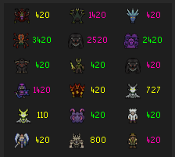 | 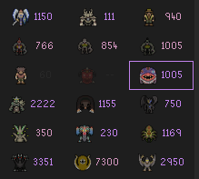 |

16,777,216^5 = 1,329,227,995,784,915,872,903,807,060,280,344,576 combinations

## Configuration

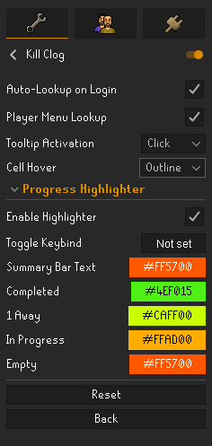

Auto-Lookup on Login\
Hover | Click\
Tint | Outline | None

## Bonus

Days of clicking the wrong HiScores tab and firing into the void are behind us. Ironman types are automatically identified and ranked among the correct set of HiScores (regular/iron/uim/hcim/gim).   

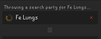

Rotating system messages

## Local Cache

Player data is cached locally for fast repeat searches. Lookups under 5 minutes old serve from cache; older ones refresh on next search. The panel also auto-refreshes your own data when you chat in-game, so a long session stays current without a manual lookup. Clear the cache manually by deleting files from `.runelite/kill-clog/`.

## TempleOSRS

Your collection log syncs locally with the red trophy icon. That data lives on your machine and never expires. Lookups for other players read from [TempleOSRS](https://templeosrs.com); anyone who hasn't synced their clog to Temple (via Temple's RuneLite plugin) won't have data available.

## Updates

If new collection log items are released in game updates, re-sync with the red trophy icon in your collection log.

---

Questions or feedback? Open an issue on [GitHub](https://github.com/420kc/kill-clog-plugin/issues).

