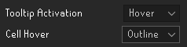
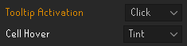
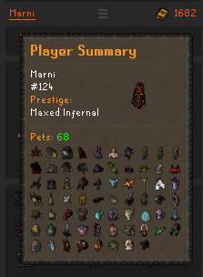

# Kill Clog

Streamlined PvM-focused HiScores Overhaul with Collection Log integration.

One click to sync your log.

## Panel

## Tooltips

| | | | |
|:---:|:---:|:---:|:---:|
|  |  |  |  |
| Hover + Outline | | | Click + Tint |

## Summaries

Character Summaries. Info where you want it and not where you don't.
| | | |
|:---:|:---:|:---:|
|  |  |  |
|  |  |  |

## Activities Tray

| | | |
|:---:|:---:|:---:|
|  |  |  |

Informative | Focused

## Progress Highlighter

Five fully-configurable colors: 4 tiers of collection log progress and a 5th configurable accent color for your Summaries.

## Configuration

Self-search on Login
Hover | Click
Tint | Outline | None

## Bonus

Days of clicking the wrong HiScores tab and firing into the void are behind us. Enter your name and press enter. Kill Clog takes care of the rest. 

Rotating system messages with a hint of personality

## TempleOSRS

Designed to be used with automatic local cache. Built in TempleOSRS support allows you to see your friend's collection logs when you look them up provided they've synced their profile. 

