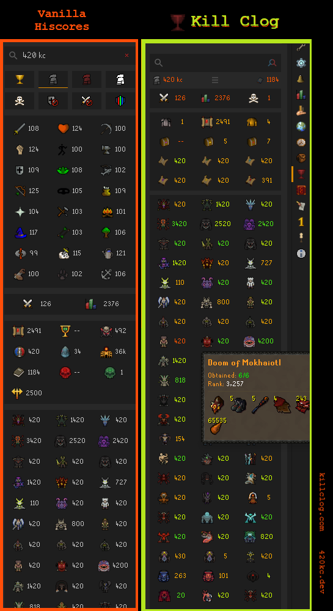
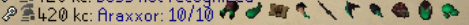
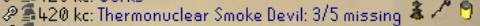
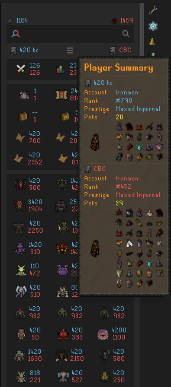
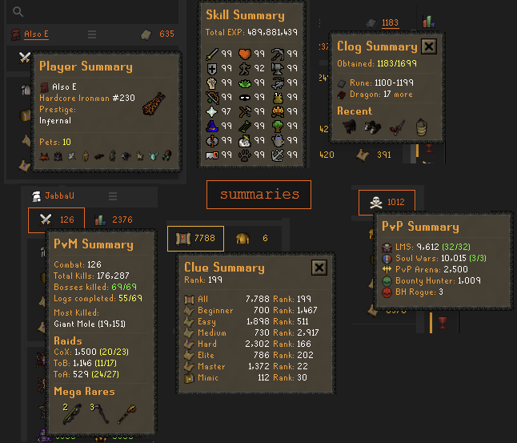
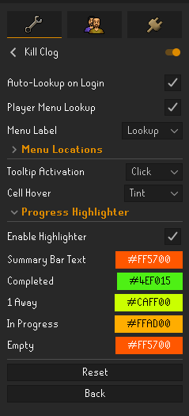

# Kill Clog

Kill Clog is a HiScores overhaul that enables collection log visualization for yourself and other players who have synced to TempleOSRS or RuneProfile.

## Feature List

- Side-by-side Player Comparison
- Summary tooltips with condensed stats
- Unified searchbar with account type autodetection
- Collection log chat commands
- Automatic sync of new collections
- Configurable right-click menu options

## privacy and data

Public player lookups read from [TempleOSRS](https://templeosrs.com) and [RuneProfile](https://runeprofile.com). The install warning is about those external lookups. Kill Clog does not use `killclog.com` as a player-profile source or upload your clog data.

Source code is public at [github.com/420kc/kill-clog-plugin](https://github.com/420kc/kill-clog-plugin) and open to audit.

## installation

1. Install Kill Clog from the RuneLite Plugin Hub.
2. In the RuneScape game settings, enable **Collection Log Chat Messages**.
3. Optional, but useful for public visibility: keep your TempleOSRS and/or RuneProfile data synced so other players can see your public clog.

## sync

Open your collection log in-game, click the red chalice at the top.

That updates your local Kill Clog cache. To make your clog visible to other Kill Clog users, sync your public data through TempleOSRS and/or RuneProfile.

## auto-sync

Your local data auto-refreshes from collection log chat messages. Long sessions stay current without re-syncing.

## quick lookup

Configurable right-click menu options to search players on Kill Clog.

Double-click the magnifying glass to look up yourself.

## chat commands

`!kclog [boss]` shows your collected items.

`Vorkath: 12/14 [item] [item] [item] ...`

`!missing [boss]` shows unobtained items.

`Vorkath: 2/14 missing [item] [item]`

`!3a`

`!gilded`

## player comparison

Compare any two players side by side.

## summaries

Six grouped readouts: player, skills, clog, PvM, clues, PvP. Now available in Comparison mode (1.4.0+)

## activities tray

Open or collapse the tray with the summary-bar menu button.

## configuration

- Auto-Lookup on Login
- Player Menu Lookup
- Menu Locations
- Tooltip Activation (Hover, Click)
- Cell Hover (Outline, Tint, None)
- Progress Highlighter (full color customization)

## local cache

Local cache keeps repeat searches fast (5 min TTL). Clear by deleting `~/.runelite/kill-clog/`.

---

Questions or feedback? Open an issue on [GitHub](https://github.com/420kc/kill-clog-plugin/issues).
