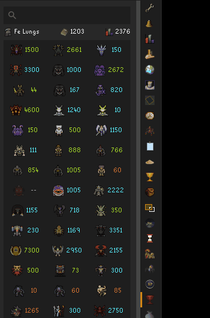

# Kill Clog

Reimagine your boss log.

<table>
  <tr>
    <td></td>
    <td></td>
  </tr>
</table>

## Features

### Unified Account Type Search

No more flipping between HiScores tabs. Unified search supports automatic account type detection and displays it next to the username (Regular/Iron/HCIM/UIM).

### Collection Log Tooltips

Hover any boss to see their full collection log in familiar native layout. Shows Obtained items, missing items, duplicate counts, and kill count ranks.

### Completionist's Highlighter

Every boss KC number is colored by collection log completion:

- **Completed** = all unique items obtained
- **In Progress** = at least one item obtained
- **Empty** = kills but no uniques logged yet

All three colors are configurable and have a keybind toggle for on/off (unset by default).

<table>
  <tr>
    <td></td>
    <td></td>
  </tr>
</table>

### Info Bar

Name, badge, clog count, and total level at a glance. Rotating search and not-found messages for mild amusement.

## Setup

Collection log data comes from [TempleOSRS](https://templeosrs.com). To sync:

1. Install the **TempleOSRS** plugin from the Plugin Hub
2. Open your collection log in-game
3. Click the **Temple sync button** in the top right

Your last sync date shows at the bottom of the panel in gray (or red if the collection log data is older than 90 days). See the [TempleOSRS guide](https://templeosrs.com/faq.php#CATEGORY_06) for more details.

No Temple data? Tooltips hide gracefully and Kill Clog works as a clean boss kill count panel on its own.

## Usage

- Type a name and press Enter.
- Right-click any player in-game and select **Kill Clog** to look them up.
- Any player who has synced their collection log with TempleOSRS will have Collection Log tooltips enabled when you search for them.

## Configuration

| Setting | Description |
|---|---|
| Auto-Lookup on Login | Look up your own stats on login |
| Show Collection Log | Enable or disable clog tooltips |
| Player Menu Lookup | Add "Kill Clog" to the right-click player menu |
| Info Bar Color | Color for RSN, Collection Count, and Total Level |
| Enable Highlighter | Color boss KC by collection log completion |
| Toggle Keybind | Shortcut to toggle the highlighter |
| Completed / In Progress / Empty | Highlighter colors, fully configurable |

## Issues

Bugs/Questions? [Open an issue](https://github.com/420kc/kill-clog-plugin/issues) on GitHub.
