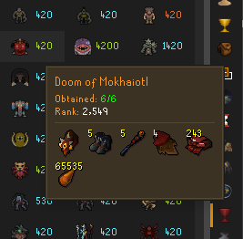
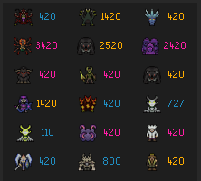
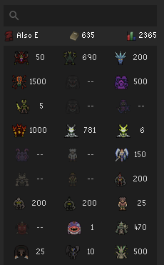

# Kill Clog

Your entire PvM career in one panel.

Kill Clog is a boss log that actually tells you something. Every cell is interactive. Hover a boss and see its full collection log. Hover your combat level and get a PvM breakdown with raid completions and megarare counts. Hover a clue tier and see what you're missing. Everything you'd normally dig through three different interfaces to find is right here, styled to look like it belongs in the game.

## Tooltips

The heart of Kill Clog. Native OSRS parchment styling with stone borders, built from actual game sprites.

### Boss Tooltips

Hover any boss to see its full collection log: obtained items, missing items, duplicate counts, and KC rank. Items render as in-game sprites in a compact grid.

### Summary Tooltips

The info bar and activities tray have five summary cells, each with its own rich tooltip:

| Cell | Tooltip | Shows |
|---|---|---|
| **Player name** | Player Summary | Account type, rank, total XP, pets owned (sprite grid) |
| **Combat level** | PvM Summary | Boss kills, logs completed, most-killed boss, raid KCs with clog progress, megarare counts |
| **Clog count** | Clog Summary | Current tier + icon, progress to next tier, last sync date, 4 most recent drops |
| **Clue All** | Clue Summary | All 8 clue tiers with scores, ranks, and tier sprites |
| **Skull icon** | PvP Summary | LMS, Soul Wars, PvP Arena, Bounty Hunter scores with clog counts where applicable |

### Clue Tooltips

Each of the six clue tiers has its own tooltip with a sprite grid of every item in that tier's drop table, colored by obtained/missing status.

## Progress Highlighter

Toggle the highlighter and every KC number in the panel changes color based on collection log completion:

- **Completed** — all uniques obtained
- **1 Away** — missing exactly one item
- **In Progress** — at least one item obtained
- **Empty** — kills but no uniques logged

Applies to bosses, clue tiers, activities, and rare cells. All four colors are configurable. Keybind toggle available.

<table>
  <tr>
    <td></td>
    <td></td>
  </tr>
</table>

## Account Type Detection

Kill Clog queries all four hiscore endpoints in parallel and detects account type automatically. No dropdowns, no guessing. Works for Regular, Ironman, Hardcore, and Ultimate accounts.

## Collection Log Sources

Kill Clog can pull collection log data from three places:

- **TempleOSRS** — synced clog data for any player
- **Local cache** — reads your own collection log directly from the in-game widget as you browse it
- **Both** (default) — local data is authoritative for your account, Temple fills in everyone else

Your last sync date is shown in the Clog Summary tooltip. Green if recent, red if stale (>90 days).

No clog data at all? Kill Clog still works as a clean boss KC panel. Tooltips with clog content simply don't appear.

## Setup

To get collection log data for TempleOSRS lookups:

1. Install the **TempleOSRS** plugin from the Plugin Hub
2. Open your collection log in-game
3. Click the **Temple sync button** in the top right

For your own account, just browse your collection log in-game and Kill Clog will cache it locally — no Temple sync required.

## Usage

- Type a name and press Enter
- Right-click any player in-game → **Kill Clog**
- Auto-lookup on login (configurable)

## Configuration

| Setting | Description | Default |
|---|---|---|
| Auto-Lookup on Login | Look up your own stats when you log in | On |
| Collection Log Source | Temple, Local, or Both | Both |
| Player Menu Lookup | Add "Kill Clog" to right-click player menu | On |
| Tooltip Activation | Hover or Click-to-reveal | Hover |
| Cell Hover Style | Outline, Tint, or None | Outline |
| Enable Highlighter | Color cells by clog completion | On |
| Toggle Keybind | Shortcut to toggle highlighter | Unset |
| Info Bar / Completed / 1 Away / In Progress / Empty | Fully configurable colors | — |

## Issues

Found a bug? [Open an issue](https://github.com/420kc/kill-clog-plugin/issues).
