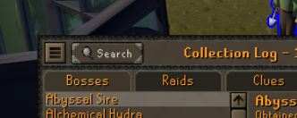
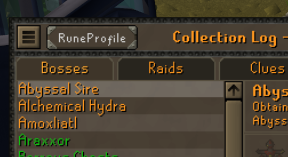
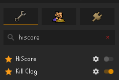
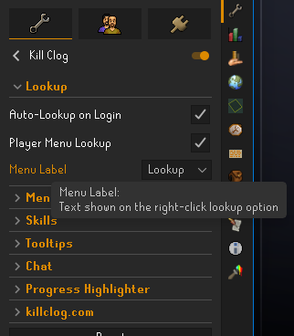
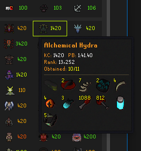
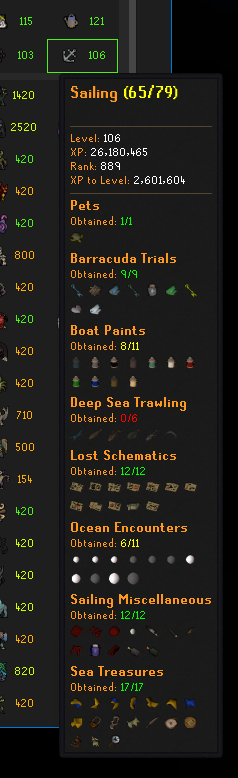
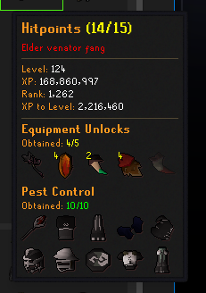
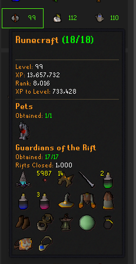

# Kill Clog

[](https://runelite.net/plugin-hub/show/kill-clog)

Kill Clog brings HiScores and Collection Log progress together in one RuneLite panel, with boss personal bests, Skill Clogs, Combat Achievements, clues, and player comparison.

## First-time setup

Install **Kill Clog** from the RuneLite Plugin Hub and open its side panel while logged in. Your account loads automatically.

To set up your Collection Log:

1. Open your Collection Log in-game.
2. Choose **Search** at the top:
   - If the button says **Search**, left-click it.
   - If the button says **RuneProfile**, right-click it and choose **Search**.

| Search button | Search with RuneProfile |
| :---: | :---: |
|  |  |

Kill Clog will confirm setup in chat.

Your Collection Log is saved locally in `~/.runelite/kill-clog/`. New Collection Log chat messages keep it current after the first scan.

## Look up other players

Enter an RSN in the search bar, or right-click a supported player or name and choose **Kill Clog**.

Use the comparison button beside the search bar to load a second player.

**Recommended for a full HiScore replacement:** Turn off RuneLite's **HiScore** plugin and set **Menu Label** to **Lookup** in Kill Clog's settings.






HiScores load for any valid RSN. Collection Log details appear when that player has data available through TempleOSRS, RuneProfile, or Kill Clog Sync.

## Modals

Click a summary, boss, activity, or skill cell to open its modal. Choose Hover under **Modal Appearance** to preview on hover and click to pin.

Modals can show Collection Log progress, item sprites and duplicate quantities, KC, rank, personal bests, and OSRS Wiki links.



## Skill Clogs

| Sailing | Hitpoints | Runecraft |
| :---: | :---: | :---: |
|  |  |  |

Every skill has its own Collection Log-style progression. Skill modals combine relevant activities, equipment, and unlocks with the skill's level, XP, rank, and XP to next level.

The skill title shows combined progress. Each section shows its own `Obtained: x/y` count. Items shared between sections count once toward the skill total.

Skills appear in the main grid by default. They can also be moved to the activity tray or hidden behind Skill Summary. Synced accounts can use the configured Skill Color, level-99 completion, or overall Skill Clog progression.

## Killclog.com sync

Killclog.com sync is optional and off by default. It is separate from the local Collection Log setup above.

Enable **Sync Collection Log to Killclog.com** to publish your Collection Log and personal bests to your killclog.com profile. The sync button in the panel publishes immediately.

**Publish Character Model** is also off by default and requires Killclog.com sync. It adds a one-click button to publish your current character and follower models to your killclog.com/p/ profile.

Manual syncs and character publishes show progress and failure messages in the panel; success flashes the corresponding icon green. **Silent automatic sync** is enabled by default and hides automatic panel messages and flashes. Chat messages have their own setting under **Chat**.

## Chat

| Command | Result |
| --- | --- |
| `!kclog [boss or clue tier]` | Collected items |
| `!missing [boss or clue tier]` | Missing items |
| `!3a` | Third-age progress |
| `!gilded` | Gilded progress |

Clue tiers accept names such as `medium clues` or `clues medium`. When RuneProfile is disabled, `!log medium clues` and `!log missing medium clues` use the same clue pages.

## Settings

- **killclog.com:** Collection Log sync, Publish Character Model, and Silent automatic sync
- **Modal Appearance:** activation, hover feedback, Wiki links, KC, PB, and rank
- **Lookup:** automatic self-lookup, player comparison, and player-menu lookup
- **Menu location:** choose which right-click menus show Kill Clog
- **Skills:** location, virtual levels, and synced-account color mode
- **Chat:** plugin messages and custom emojis
- **Progress Highlighter:** Collection Log progress colors

## Data and privacy

Public lookups read from Jagex HiScores, [TempleOSRS](https://templeosrs.com), [RuneProfile](https://runeprofile.com), and [killclog.com](https://killclog.com). Item names resolve through the [OSRS Wiki](https://oldschool.runescape.wiki). These requests expose your IP address to the service being contacted, which is why RuneLite shows a third-party warning on install.

Killclog.com sync is opt-in. Nothing from your local Collection Log is published until you enable it. Turning sync or Publish Character Model off stops new publishes but does not delete data already published. Use the [opt-out page](https://killclog.com/p/opt-out.html) to request deletion.

TempleOSRS EHB rates are bundled with the plugin and refreshed with releases. Computing EHB does not make another request.

The source is public at [github.com/420kc/kill-clog-plugin](https://github.com/420kc/kill-clog-plugin).

## Development

Kill Clog builds with Java 11 and the included Gradle wrapper.

```powershell
.\gradlew.bat clean compileJava checkstyleMain checkstyleTest test jar
```

Launch the development client with:

```powershell
.\gradlew.bat run
```

The release jar is written to `build/libs/`.

## Custom emojis

`:killclog:` `:rune:` `:dragon:` `:gilded:` `:clog:` `:green:`

## Support

If a total, item mapping, or tooltip looks wrong, open an [issue](https://github.com/420kc/kill-clog-plugin/issues) with the RSN and a screenshot.
