# Kill Clog

[](https://runelite.net/plugin-hub/show/kill-clog)

HiScores, Collection Logs, Personal Bests, and player comparison in one RuneLite panel.

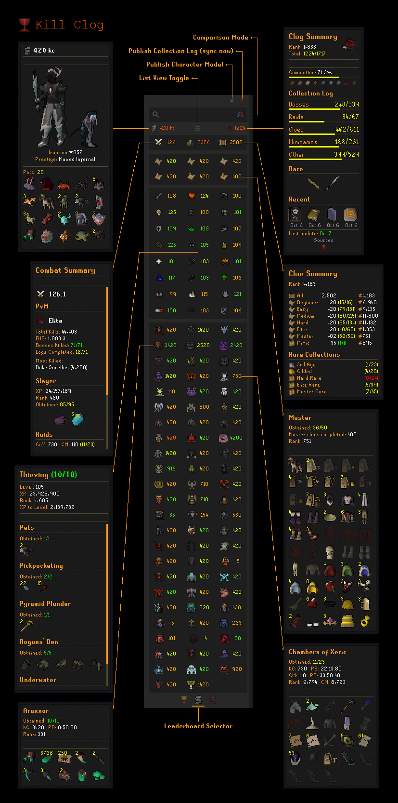

## Setup

Install **Kill Clog** from the RuneLite Plugin Hub and open its panel while logged in. Your account loads automatically.

Open your Collection Log and leave it open until setup confirms completion in chat. Setup runs automatically.

Your log is saved locally and updates with new unlocks as you play. Open the Collection Log any time to catch items you got on mobile or another device.

To retry an update, reopen the log or choose **Search** at the top. If it says **RuneProfile**, right-click it and choose **Search**. Interrupted updates keep your saved log.

## Kill Clog Web Sync

Optional and off by default.

**Sync Collection Log** publishes your Collection Log, unlock dates and personal bests to your killclog.com profile. The chalice button (**publish collection log**) publishes right away. Open the in-game log first so it's current.

**Publish Character Model** needs Sync Collection Log. It adds the **publish character** button beside the chalice, which publishes your character and follower in your real appearance. Anyone who looks you up in Kill Clog sees them in your Player Summary.

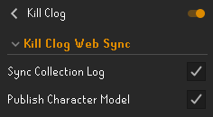

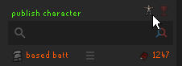

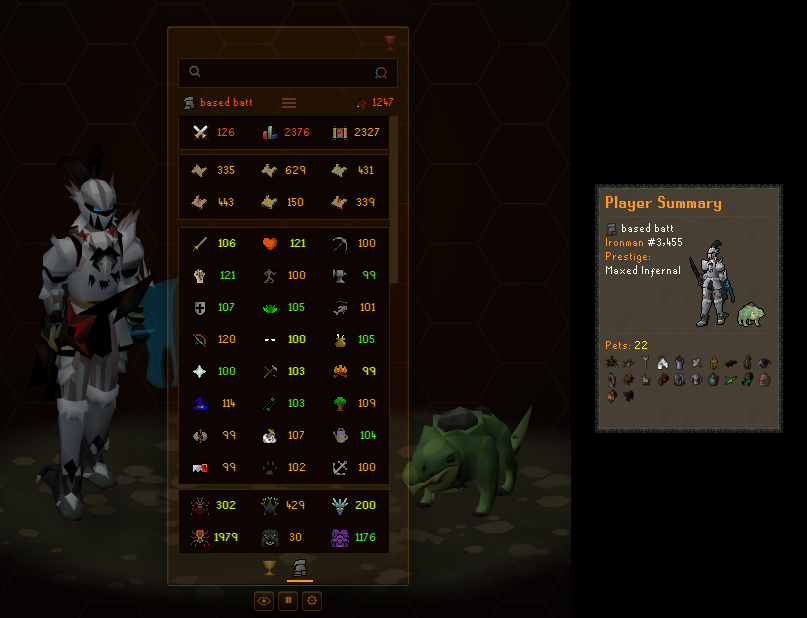

The icon will flash green on a successful upload.

## Skill Clogs

Every skill has its own Collection Log-style progression. Skill cards combine relevant activities, equipment, and unlocks with the skill's level, XP, rank, and XP to next level.

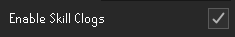

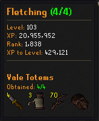

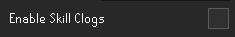

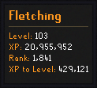

## Player Lookup

Enter an RSN in the search bar, or right-click a supported player or name and choose **Kill Clog**.

Use the comparison button beside the search bar to load a second player.

While a League runs, a **Leagues** switch beside the search bar flips the panel between League and main game stats.

**Recommended for a full HiScore replacement:** Turn off RuneLite's **HiScore** plugin and set **Menu Label** to **Lookup** in Kill Clog's settings.

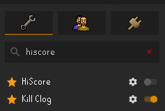

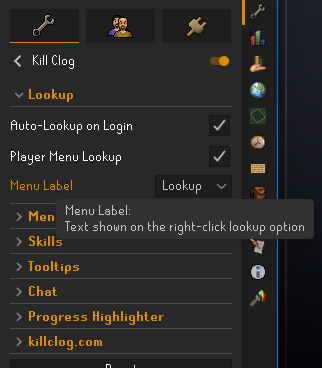

HiScores load for any valid RSN, including Collection Log totals and ranks when listed. Item-by-item Collection Log details appear when that player has data available through TempleOSRS, RuneProfile, or Kill Clog.

Browse the entire Collection Log through the Clog Summary's navigation.

## Grid and List views

Toggle between the default Grid view and List view with the **Menu** button under the search bar. Comparison uses Grid view.

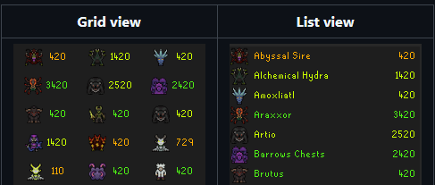

## Leaderboard selector

Turn on **Show Leaderboard Selector** under **Lookup** to switch between the hiscores a player is on, using the icons below the grid.


A Hardcore who died keeps their stats from the moment of death on the Hardcore tab, marked with a skull on the helm. A de-ironed account's old Ironman stats get a crossed-out helm. Comparisons and new lookups always use each player's own leaderboard.

## Chat Commands

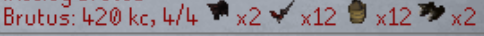

| Command | Result |
| --- | --- |
| `!kclog [page]` | Collected items and duplicate quantities |
| `!missing [page]` | Missing items |
| `!3a` | Third-age progress |
| `!gilded` | Gilded progress |
| `!kc [item name]` | KC when the item was obtained, if recorded locally |

Use any Collection Log page, including pages outside the panel. Try `!kclog pets`, `!kclog mixology`, `!kclog random events`, or `!missing medium clues`. Pet totals count unique pets; quantities beside sprites show dupes.

**Keep RuneLite's Chat Commands enabled** for `!pets`, `!clues medium`, `!kc [boss]`, and `!pb [boss]`. It is separate from the HiScore plugin.

RuneProfile handles `!log` while enabled. With RuneProfile off, Kill Clog handles `!log [page]` and `!log missing [page]`.

Full page names work, and shorthand such as `gotr`, `mixology`, `pets`, and `hydra` works too. See the [full page and shortcut chart](docs/chat-commands.md#page-names-and-shorthand) for every supported alias, command ownership, and examples. Skill Clog aggregates are not separate chat pages.

## Settings

- **Kill Clog Web Sync:** Collection Log sync, Publish Character Model, and Silent automatic sync
- **Card Appearance:** activation, hover feedback, Wiki links, KC, PB, and rank
- **Lookup:** automatic self-lookup, player comparison, player-menu lookup, and the leaderboard selector
- **Menu location:** choose which right-click menus show Kill Clog
- **Skills:** location, virtual levels, synced-account color mode, and Skill Clogs on or off
- **Chat:** plugin messages and custom emojis
- **Progress Highlighter:** Collection Log progress colors

## Data and privacy

Public lookups read from Jagex HiScores, [TempleOSRS](https://templeosrs.com), [RuneProfile](https://runeprofile.com), and [killclog.com](https://killclog.com). Item names resolve through the [OSRS Wiki](https://oldschool.runescape.wiki). These requests expose your IP address to the service being contacted, which is why RuneLite shows a third-party warning on install.

Web publication is opt-in. Nothing from your local Collection Log is published until you enable **Sync Collection Log**. Disable that setting to stop all web publication, or **Publish Character Model** to stop character updates. Already published data remains until you request deletion through the [opt-out page](https://killclog.com/p/opt-out.html).

TempleOSRS EHB rates are bundled with the plugin and refreshed with releases. Computing EHB does not make another request.

The source is public at [github.com/420kc/kill-clog-plugin](https://github.com/420kc/kill-clog-plugin).

## Development

Kill Clog builds with Java 11 and the included Gradle wrapper.

```powershell
.\gradlew.bat clean compileJava checkstyleMain checkstyleTest test jar
```

Launch the development client with:

```powershell
.\gradlew.bat run
```

The release jar is written to `build/libs/`.

## Custom emojis

`:killclog:` `:rune:` `:dragon:` `:gilded:` `:clog:` `:green:`

## Support

If setup, a total, an item mapping, or a card looks wrong, open an [issue](https://github.com/420kc/kill-clog-plugin/issues) with your Kill Clog version, the RSN, and a screenshot.
